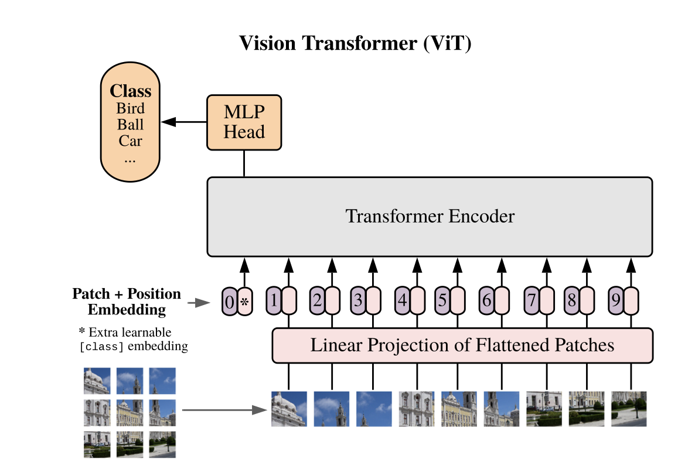

# Vision Transformer + Transformer Decoder for Image Captioning.

Transformer is a powerful model utilizing Attention Mechanism. <br>
First proposed by [Attention is All You Need](https://arxiv.org/pdf/1706.03762.pdf) and used in Sequence to Sequence Tasks. <br>
Later, [An Image is Worth 16x16 Words: Transformers for Image Recognition at Scale](https://arxiv.org/pdf/2010.11929.pdf) proposed ViT a Vision Transformer which directly apply Transformer on Images. <br>
For this task, we use a pretrained ```google/vit-base-patch16-224``` pretrained ViT as encoder, and a Transformer Decoder.


A standard Transformer Block <br>

___
Vision Transformer ViT <br>

___


Please skip 1~3 if you have already finished Lab3 (using the same dataset).

**Please copy the full data/ folder from Lab3 to your Lab5 folder, and start with step 4 (You should have done step 1~3 in Lab3)**

1. To down load the MSCOCO dataset:
```
sh download.sh
```

2. Preprocessing data
```
python3 resize.py
```

3 .Build vocabulary for caption text
```
python3 build_vocab.py
```

4. Install transformers

```
pip3 install transformers
```

5. Train Image Captioning
```
python3 captioning_DIY.py
```

6. Sample an image for testing
```
python3 sample.py --image_path <any image path>
python3 sample.py --image_path ./data/train2014/COCO_train2014_000000581921.jpg
```


## Additional Resources
* ViT_example.py
    This code shows how to implement a standard ViT from scratch.